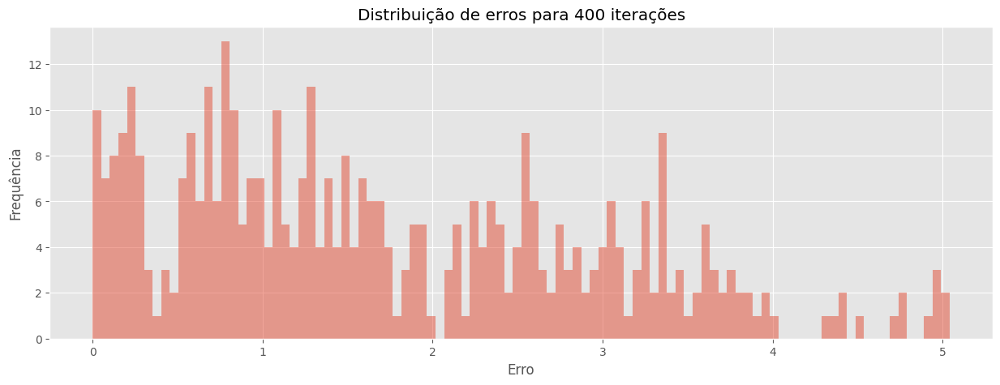
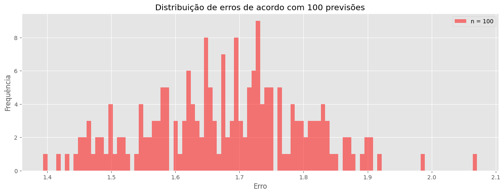
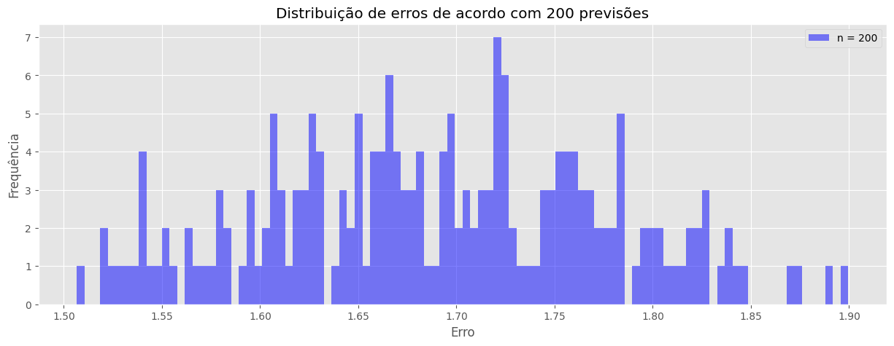
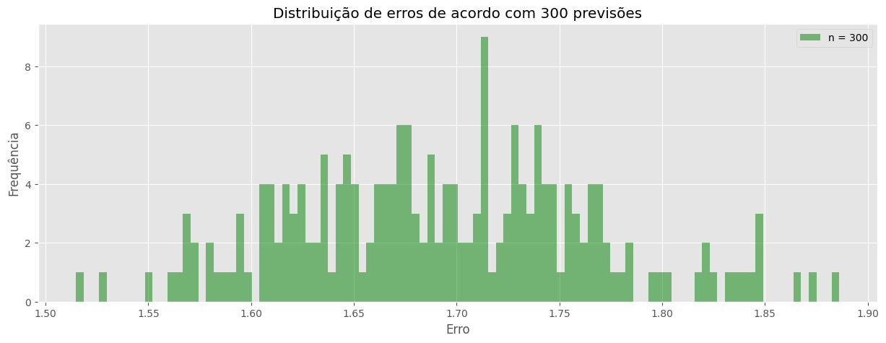

# Netflix-Challenge

Projeto da matéria de Álgebra Linear que possuía como finalidade criar um sistema preditor de nota de filmes por usuários com base em dados de avaliações de filmes realizadas pelos próprios usuários.


# Desafio

Pergunta milionária: ***eu vou gostar deste filme?***

Nesse sentido, para responder essa pergunta precisamos prever qual nota um usuário atribuiria a um filme que ele ainda não assistiu. 
       
Utilizaremos a técnica **SVD** (Singular Value Decomposition) | (Decomposição em Valores Singulares) para prever o valor "real" de um elemento estragado em uma matriz, ou seja, para prever a nota que um usuário deveria atribuir a um filme que ele ainda não assistiu.

# Processo

### Dados
Dados passados de classificação que serão utilizados para auxiliar a previsão.

[Link pra o dataset](https://www.kaggle.com/datasets/rounakbanik/the-movies-dataset)


<br>

Com os dados criamos uma Matriz Original, definida por UserID X MovieID, onde os valores são os ratings (dados por cada user a cada filme)

<br>

$$
Matriz Original = \begin{bmatrix}
User_0 X Movie_0 & User_0 X Movie_1 & User_0 X Movie_2 & User_0 X Movie_3 & User_0 X Movie_4 & User_0 X Movie_5 & User_0 X Movie_n\\ 
User_1 X Movie_0 & User_1 X Movie_1 & User_1 X Movie_2 & User_1 X Movie_3 & User_1 X Movie_4 & User_1 X Movie_5 & User_1 X Movie_n\\
User_n X Movie_0 & User_n X Movie_1 & User_n X Movie_2 & User_n X Movie_3 & User_n X Movie_4 & User_n X Movie_5 & User_n X Movie_n
\end{bmatrix}
\hspace{0.5in}
$$

<br>

O primeiro passo é escolher aleatoriamente um dos elementos da matriz $B$, (desde que esse elemento seja de fato um valor, não podendo ser nan)

Atribuir a ele um valor aleatório, gerando a matriz $B$. O que simula o caso em que um usuário ainda não assistiu a um filme e, sendo assim não atribuiu uma nota a ele, com isso nós estamos inserindo ruído na matriz orignal.

<br>

$$
B = \begin{bmatrix}
Ruído & User_0 X Movie_1 & User_0 X Movie_2 & User_0 X Movie_3 & User_0 X Movie_4 & User_0 X Movie_5 & User_0 X Movie_n\\ 
User_1 X Movie_0 & User_1 X Movie_1 & User_1 X Movie_2 & User_1 X Movie_3 & User_1 X Movie_4 & User_1 X Movie_5 & User_1 X Movie_n\\
User_n X Movie_0 & User_n X Movie_1 & User_n X Movie_2 & User_n X Movie_3 & User_n X Movie_4 & User_n X Movie_5 & User_n X Movie_n
\end{bmatrix}
\hspace{0.5in}
$$

<br>

### Decompondo a matriz $B$ 

Na decomposição SVD, usamos a formulação:

<br>

$$
B = U @ Sigma @ V^T
$$

<br>

onde:

* As colunas de U são os auto-vetores de $B^T B$,
* As colunas de V (e, portanto, as linhas de $V^T$) são auto-vetores de $B B^T$,
* Sigma é uma matriz onde $s_{i,i}$ é a raiz quadrada dos auto-valores de $B^T B$ ou de $B B^T$.

<br>

**Matriz Sigma**: Os valores singulares são números da diagonal principal da matriz Σ que representam a importância relativa das colunas e linhas da matriz original.

Com a inserção de ruído os valores singulares menores são os mais afetados, e por isso iremos buscar reduzir essa diferança para que assim possamos voltar o mais próximo da matriz original, partindo de uma matriz com ruído (no nosso caso de um ponto onde não temos rating).

Para realizar a redução de dimensionalidade, a decomposição SVD é aplicada na matriz original, e os valores singulares maiores são selecionados ao passo que os menores são descartados. As colunas correspondentes aos valores singulares maiores são selecionadas e formam uma matriz menor new_Matriz, que é uma aproximação da Matriz Original com menos ruído, partindo de uma matriz com ruído B.

A partir da new_Matriz podemos acessar um valor, e comparar a diferença dele com o valor real na Matriz Original.

Executando o processo diversas vezes é possível gerar um histograma dos erros cometidos. O que permite avaliar a eficiência do SVD em prever os valores "reais" na Matriz Original. Quanto menor o erro médio, melhor a técnica de SVD é para prever as notas que um usuário daria a um filme que ele ainda não assistiu

<br>

## Resultados encontrados

### Histograma de erros

Este histograma mostra a distribuição dos erros após 400 iterações. O eixo x representa o erro cometido (módulo da diferença do valor original para o novo valor) e o eixo y representa a frequência de cada erro.




### Testes de stress

Para gerar os histogramas abaixo, alteramos o número de elementos que foram modificados na matriz original, e assim geramos novos histogramas de erros.

<br>

#### 100 elementos modificados


#### 200 elementos modificados


#### 300 elementos modificados


## Conclusão 

Após a análise dos histogramas gerados, acreditamos que o sistema poderia ser colocado em produção, uma vez que estabelecemos como erro máximo 2.5, dado que a avaliação vária no intervalo 0-5.

Nos três últimos gráficos, onde foram realizadas 200 iterações em cada um e os ruídos na matriz são iguais à 100, 200 e 300, respectivamente, percebemos pela distribuição dos erros que a maior frequência ocorreu entre valores de 1.4 até 2.1.

Sendo assim um consideramos um erro de 2 estrelas no ranking, possível de ir para produção, mas com espaço para melhoras na performance.

<br>

# Como executar o projeto

**1.** Clone o repositório para sua máquina local<br>

```git clone https://github.com/alessitomas/Netflix-Challange.git```<br>

**2.** Instale as dependências do projeto<br>

```pip install -r requirements.txt```<br>

**3.** Execute as células do arquivo jupyter notebook **demo.ipynb**<br>

<br>

# Autores

* [Tomás Alessi](https://github.com/alessitomas)
* [Leonardo Scarlato](https://github.com/leoscarlato)


